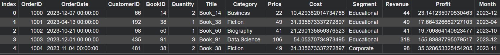
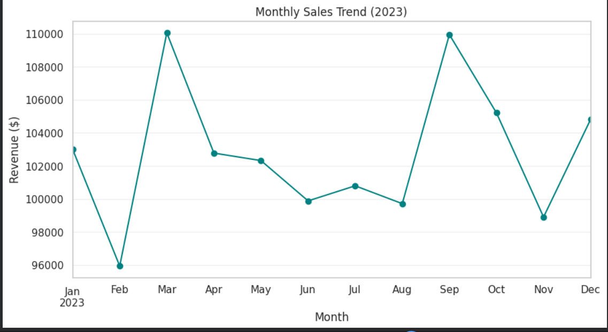
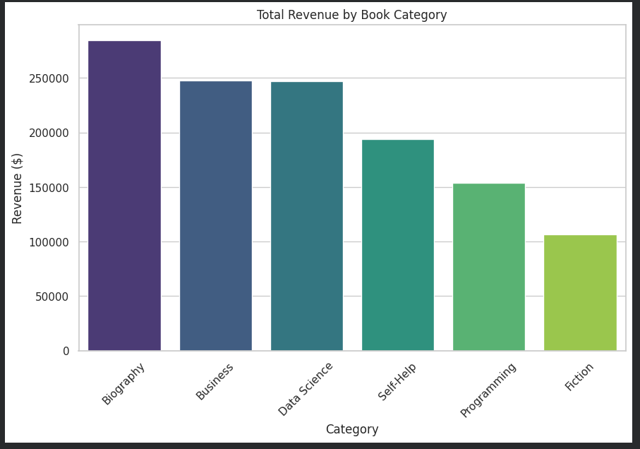
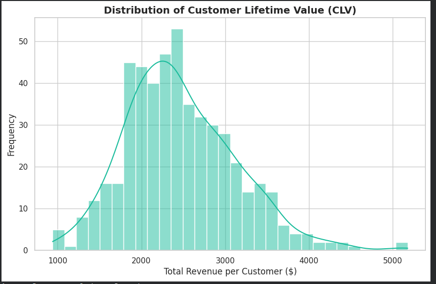
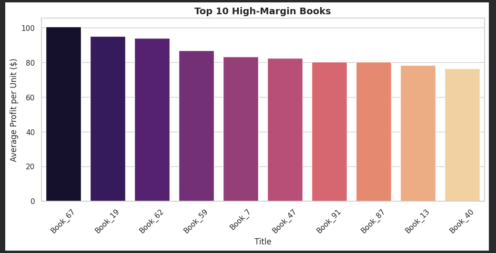
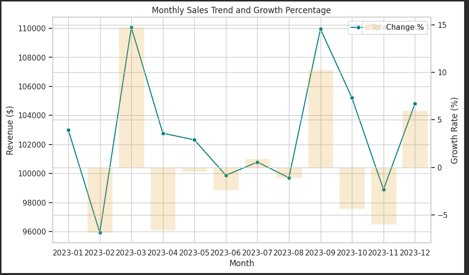

# 📚 Bookstore Sales Analysis Dashboard

A data analytics project focused on understanding bookstore sales performance, customer purchasing behavior, category trends, and profitability using Python, Pandas, Matplotlib, and Seaborn.

---

## 🎯 Project Objective

The goal of this project is to analyze bookstore transaction data and answer key business questions:

- Which book categories generate the most revenue?
- How do sales change throughout the year?
- Which customers contribute the most value?
- Which books produce the highest profit margins?
- What patterns can be identified from customer purchasing behavior?

The dataset used in this project was generated for learning and portfolio purposes.

---

## 🛠️ Tools & Technologies

| Category | Tools |
|-----------|---------|
| Programming | Python |
| Data Analysis | Pandas, NumPy |
| Visualization | Matplotlib, Seaborn |
| Notebook Environment | Google Colab / Jupyter Notebook |
| Analytics | Exploratory Data Analysis (EDA) |

---

# 📊 Dataset Overview

The project simulates a bookstore environment with:

- 12,000 transactions
- 500 customers
- 100 books
- 6 product categories
- Full year sales data (2023)

---

## Dataset Preview

---

# 📈 Key Performance Indicators (KPIs)

The following KPIs were calculated:

- Total Revenue
- Average Order Value
- Customer Lifetime Value (CLV)
- Revenue by Category
- Profit per Book
- Monthly Sales Growth

---

# 📅 Monthly Sales Trend

Understanding how revenue changes across the year.

### Key Findings

- Revenue peaks during March and September.
- Sales remain relatively stable throughout the year.
- Seasonal fluctuations indicate periods of increased customer demand.

---

# 📚 Revenue by Book Category

Analyzing which categories contribute most to overall revenue.

### Key Findings

- Biography books generated the highest revenue.
- Business and Data Science categories performed consistently well.
- Fiction contributed the least revenue in this dataset.

---

# 👥 Customer Lifetime Value Analysis

Evaluating customer spending patterns and identifying high-value customers.

### Key Findings

- Most customers fall within a moderate spending range.
- A small number of customers generate significantly higher revenue.
- Customer spending follows a right-skewed distribution.

---

# 💰 Top High-Margin Books

Identifying books that contribute the highest profit per unit sold.

### Key Findings

- Certain books consistently produce higher profit margins.
- High-margin titles may deserve greater promotional focus.
- Profitability varies considerably across products.

---

# 📈 Monthly Growth Analysis

Tracking month-over-month revenue growth.

### Key Findings

- Revenue growth fluctuates throughout the year.
- Positive growth periods align with seasonal sales peaks.
- Some months show contraction, highlighting natural business cycles.

---

# 🔍 Skills Demonstrated

### Data Analysis
- Exploratory Data Analysis (EDA)
- Data Cleaning
- Aggregation & Grouping
- Trend Analysis

### Python
- Pandas
- NumPy

### Data Visualization
- Matplotlib
- Seaborn

### Business Analytics
- KPI Development
- Customer Analysis
- Revenue Analysis
- Profitability Analysis

---

# 📌 Business Insights

- Customer purchasing behavior can reveal revenue opportunities.
- Category-level analysis helps identify high-performing segments.
- Monitoring monthly sales trends supports demand forecasting.
- Profitability analysis helps prioritize products with stronger margins.

---

# 🚀 Future Improvements

- Build an interactive Power BI dashboard.
- Connect to a SQL database.
- Introduce customer segmentation using machine learning.
- Deploy as an interactive web application.

---

## 👨‍💻 Author

**S.Krishna Kashyap**

